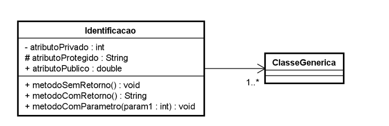

# UML

- Concepts: diagrams, elements, relationships

## Diagrams

- Structural diagrams
  - Class diagram: used to represent classes, interfaces and another components. The most important type
    - Structure: Identification, attributes, operations
  - Object diagram: used to represent objects in some moment/fact

## Relationships

- Simple association: A -> B, example: a school has students
- Bidirectional association: A <-> B
- Aggregation: A -> B, A has a relationship with B, but can exist without B. Example: a candidate has experience/previous job
- Composition: A -> B, A has a relationship with B, and can't exist without B. Example: a admission has a candidate

### Multiplicity of relationships

- `1.`: only one
- `*.`: list of elements
- `0..1`: zero or one
- `0..*`: zero or a list of elements
- `1..*`: one or a list of elements

### Visibility

- `+`: public
- `-`: private
- `#`: protected (associated with heritage)

