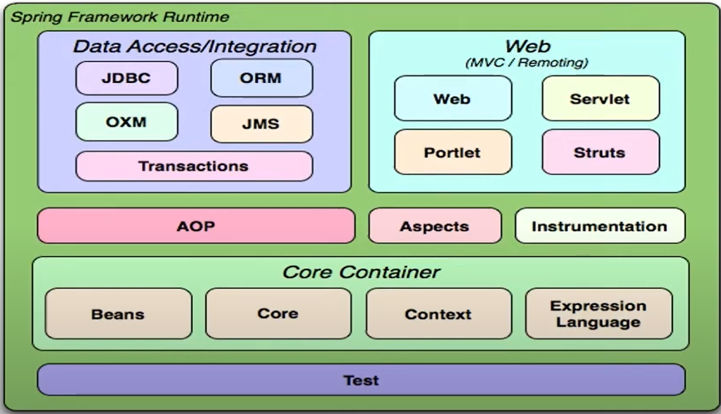

# Spring Framework Fundamentals

- Focus on IoC and DI (low acomplishment)
- Modules based
- 

## Java EE vs Spring

- You can choose between Java EE and Spring depending on the use case.

## Inversion of Control (IoC)

- Redirect the execution flux from one component to another, delegating the responsibility to another component (container).
- When starting the App, the IoC container is started. It is responsible for the creation of the objects.
  - When we need to use an object, we request it from the IoC container.

## Dependency Injection (DI)

- Focus on interfaces, the App doesn't need to know anything about the implementation.

## Beans

- Beans are the objects that are created and managed by the IoC container.

## Scopes

- Stand-alone:
  - Singleton: only one object instance is created for the lifetime of the application
  - Prototype: a new object is created for each request
- HTTP:
  - Request: a bean is created for each HTTP request
  - Session: a bean is created for each HTTP user session
  - Global (Application): a bean is created once per application lifetime

## Autowiring

- The dependency is injected automatically
  - byName: a set method that corresponds to the name of the bean
  - byType: it's considerated the type of the class to include the bean
  - byConstructor: uses the constructor to include the dependency
